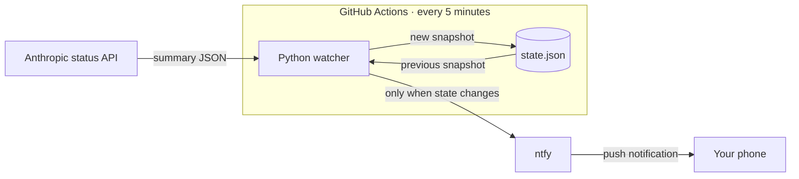
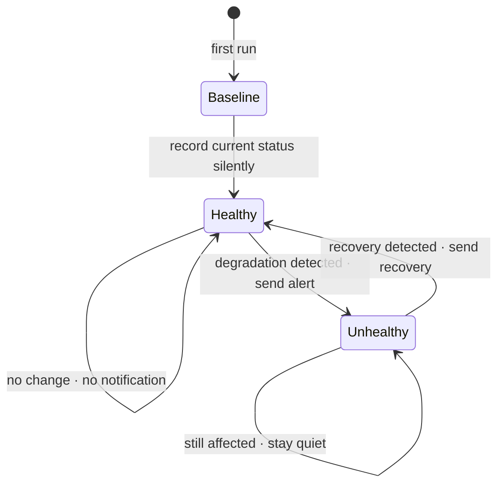

# Claude Status Notifier

## Purpose

Claude services sometimes degrade independently. claude.ai can be fine while
Claude Code is having trouble, and Claude Design may only be mentioned inside
an incident update. The useful information is which one is affected, and when
it comes back.

During my summer internship, these were the three I cared about:

- **claude.ai**
- **Claude Code**
- **Claude Design**

Anthropic's status page has subscriptions, but they include every component,
and Claude Design is not a component you can subscribe to. I wanted a notifier
specific to the services I use, so I programmed this. I'm sharing it so other
people can use it too. If you care about different services, the setup below
explains how to tailor it to your own needs.

It sends a push notification when one of those services degrades or goes down,
then another when it recovers. If nothing changes, it says nothing. This means
I do not have to keep checking the status page to see whether a service is back.

It runs in GitHub Actions and delivers through [ntfy](https://ntfy.sh/). There
is no server or database, and no computer needs to remain on.

## How to use it

### If you just want my alerts

You do not need to run any code.

1. Install the [ntfy app](https://ntfy.sh/) on your phone.
2. Add a subscription using the `https://ntfy.sh` server.
3. Subscribe to the topic `claude-status-noti-tanbaydar`.

That is it. You can also [open the notification feed in a
browser](https://ntfy.sh/claude-status-noti-tanbaydar).

### If you want your own watcher

Forking the project gives you your own topic and your own list of services.
Setup takes a few minutes:

1. **Fork this repository.**
2. **Choose an ntfy topic.** Make it long and difficult to guess, then subscribe
   to it in the ntfy app.
3. **Give the topic to the workflow.** In your fork, go to **Settings → Secrets
   and variables → Actions** and create a repository secret named `NTFY_TOPIC`.
4. **Allow snapshot updates.** Go to **Settings → Actions → General** and select
   **Read and write permissions** under Workflow permissions.
5. **Start it.** Open **Actions → Watch Claude status**, enable workflows if
   GitHub asks, and choose **Run workflow**.

The first run is intentionally quiet. It records what “normal right now” looks
like; later runs notify you only when that picture changes. You can confirm it
worked by checking that the Actions run is green and `state.json` has a recent
`checked_at` timestamp.

> **A note about ntfy topics:** on the public ntfy server, the topic name is
> effectively the address and the password. Anyone who guesses it may be able
> to subscribe or publish, so use something random rather than a familiar name.

Want to watch something different? Edit `WATCH_COMPONENTS` and
`KEYWORD_SERVICES` in [`watcher/config.py`](watcher/config.py). Then empty the
snapshot so the next run can establish a clean baseline:

```json
{
  "checked_at": null,
  "components": {},
  "keyword_incidents": {}
}
```

## What is going on technically

There are only three moving parts: Anthropic's public status API, a Python
script running in GitHub Actions, and ntfy.



The workflow in [`.github/workflows/watch.yml`](.github/workflows/watch.yml)
runs `python3 -m watcher.check` every five minutes. The watcher fetches
Anthropic's public status summary and handles the three services in two ways:

- **claude.ai and Claude Code** are regular status-page components, so their
  statuses can be read directly.
- **Claude Design** is not a component. The watcher infers its condition by
  looking for “Claude Design” or “design” in unresolved incident titles and
  updates.

The important part is that this is a *transition* watcher, not an outage
repeater. `state.json` holds the last successful observation, and each run
compares the new observation with it.



Suppose Claude Code changes from `operational` to `major_outage`. The watcher
sends one high-priority alert and records the outage. Five minutes later, if
nothing has changed, it stays quiet. When the status returns to `operational`,
it sends one recovery message.

Delivery happens before the snapshot is updated. This order matters: if the
ntfy request fails, the workflow leaves `state.json` untouched. The next run
sees the transition again and retries the notification instead of silently
losing it.

After a successful check, GitHub Actions commits the new `state.json` back to
the repository. That committed file is the entire persistence layer. It makes
the system easy to inspect, easy to fork, and free to run—at the cost of a small
automated commit history.

One defensive detail is worth calling out: if Anthropic renames or removes a
configured component, the watcher records it as `unknown`. Treating missing
data as healthy would create a false recovery alert, which is much worse than
making the uncertainty visible.

There are no third-party Python dependencies. If you want to read the project,
start with [`watcher/check.py`](watcher/check.py); the tests capture the main
behavior:

```sh
python3 -m unittest discover -s tests -v
```
